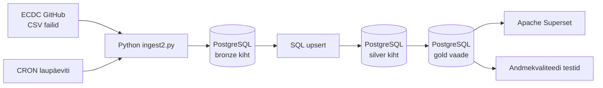

# MAMM — Euroopa hingamisteede viiruste hooajaline seire

> **Juhend:** Asenda kõik nurksulgudes vormid oma sisuga enne esitamist. Kustuta see juhendrida.

## Äriküsimus

Jälgime kolme hingamisteede haiguse (Influenza, RSV, SARS-CoV-2) levikut Euroopa riikides, et aidata inimesel otsustada, kuhu on turvalisem reisida.

**Mõõdikud:**

1. Kõrgeim positiivsete testide arv nädalate lõikes riigi ja haiguse kaupa
2. Millistel perioodidel on haigusaktiivsus kõrgeim
3. - esialgu ei lisa -

## Arhitektuur



Täpsem kirjeldus: [`docs/arhitektuur.md`](docs/arhitektuur.md)

## Andmestik

| Allikas | Tüüp | Ajas muutuv? | Roll |
|---------|------|--------------|------|
| ECDC GitHub — SARITestsDetectionsPositivity.csv | CSV | Jah, kord nädalas | Haiglaandmed |
| ECDC GitHub — sentinelTestsDetectionsPositivity.csv | CSV | Jah, kord nädalas | Perearstide andmed |

## Stack

| Komponent | Tööriist |
|-----------|---------|
| Sissevõtt | Python (ingest2.py) |
| Transformatsioon | SQL |
| Andmehoidla | PostgreSQL (pgDuckDB) |
| Näidikulaud | Apache Superset |
| Orkestreerimine | CRON (Dockeris) |

## Käivitamine

```bash
# 1. Klooni repo ja liigu kausta
git clone https://github.com/MariliisR/ecdc-haigusseire.git
cd ecdc-haigusseire

# 2. Kopeeri keskkonnamuutujad
cp .env.example .env
# Muuda .env failis paroolid vastavalt vajadusele

# 3. Käivita teenused (andmebaas, Superset, CRON)
docker compose up -d --build

# 4. Käivita andmete sissevõtt
python3 scripts/ingest2.py

# 5. Käivita transformatsioon bronze → silver
docker exec -i ecdc-haigusseire-db psql -U admin -d ecdc-haigusseire < scripts/04_incremental_upsert.sql
```

Superset: http://localhost:8088 (kasutaja: admin / parool: vaata .env)

## Saladused ja konfiguratsioon

Kõik saladused (paroolid, API võtmed, andmebaasi URL-id) on `.env` failis. Repos on ainult `.env.example`, mis näitab vajalike muutujate struktuuri ilma tegelike väärtusteta. Päris `.env` faili ei tohi GitHubi panna - see on `.gitignore`-s.

Vajalikud muutujad:

| Muutuja | Tähendus | Näide |
|---------|----------|-------|
| `DB_PASSWORD` | PostgreSQL parool | (saladus) |
| `[teised]` | ... | ... |

## Andmevoog lühidalt

1. **Sissevõtt** — [Kirjelda, kuidas andmed allikast kätte saadakse]
2. **Laadimine** — Andmed laaditakse `staging` kihti
3. **Transformatsioon** — [Kirjelda peamised arvutused ja mudelid]
4. **Testimine** — [Mitu] andmekvaliteedi testi kontrollivad korrektsust
5. **Näidikulaud** — [Kirjelda lühidalt, mida näidikulaud näitab]

## Andmekvaliteedi testid

Projekt kontrollib järgmist:

1. [Test 1 - nt: kasutajate ID on unikaalne]
2. [Test 2 - nt: tellimuse summa pole null]
3. [Test 3 - nt: kuupäev jääb vahemikku 2020-2026]
[Lisa rohkem, kui sul on]

Testide tulemused: [kuhu salvestatakse / kuidas vaadata]

## Projekti struktuur

```
.
├── README.md
├── compose.yml
├── .env.example
├── .gitignore
├── docs/
│   ├── arhitektuur.md      ← nädal 1 väljund
│   └── progress.md         ← nädal 2 väljund
└── ...                     ← ülejäänud projektifailid
```

## Kokkuvõte, puudused ja võimalikud edasiarendused

**Kokkuvõte:**
- [Loetle, mis on lõpule viidud, mis töötab hästi]

**Puudused:**
- [Loetle ausalt, mis jäi tegemata - see ei mõjuta hinnet negatiivselt, vaid aitab hinnata]

**Mis edasi:**
- [Mida tahaksid edasi teha, kui aega oleks rohkem]

## Meeskond

| Nimi | Roll |
|------|------|
| Mariliis | andmeallika omanik |
| Madli | transformatsioonide omanik |
| Mirell | andmekvaliteedi omanik |
| Annika | näidikulaua omanik |
