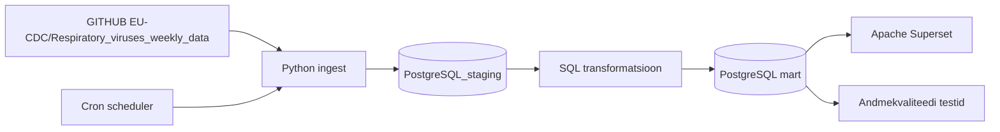

# MAMM — Euroopa hingamisteede viiruste hooajaline seire

> **Juhend:** Asenda kõik nurksulgudes vormid oma sisuga enne esitamist. Kustuta see juhendrida.

## Äriküsimus


Jälgime kolme hingamisteede haiguse (Influenza, RSV, SARS-CoV-2) levikut Euroopa riikides, et aidata inimestel hinnata haigusaktiivsust ning teha teadlikumaid reisimisotsuseid.


**Mõõdikud:**

1. Positiivsete testide arv nädalate lõikes riigi ja haiguse kaupa
    * Arvutame iga nädala kohta positiivsete hingamisteede viiruse testide koguarvu Euroopa riikides.
2. Positiivsete testide määr riikide lõikes
    * Arvutame positiivsete testide osakaalu kõigist tehtud testidest iga riigi kohta nädalapõhiselt.
3. Positiivsete testide määr viirusetüüpide lõikes
    * Võrdleme Influenza, RSV ja SARS-CoV-2 positiivsete testide määra riikide ja nädalate lõikes.

## Arhitektuur



Täpsem kirjeldus: [`docs/arhitektuur.md`](docs/arhitektuur.md)

## Andmestik

| Allikas | Tüüp | Ajas muutuv? | Roll |
|---------|------|--------------|------|
| ECDC respiratory virus surveillance data | CSV | Jah, nädalapõhiselt, laupäeviti | Põhiandmevoog |

## Stack

| Komponent | Tööriist |
|-----------|---------|
| Sissevõtt | Python |
| Transformatsioon | SQL |
| Andmehoidla | PostgreSQL |
| Näidikulaud | Apache Superset |
| Orkestreerimine | cron |

## Käivitamine


### 1. Klooni repo ja liigu kausta
```bash
git clone https://github.com/MariliisR/ecdc-haigusseire.git
cd ecdc-haigusseire
```

### 2. Kopeeri keskkonnamuutujad
```bash
cp .env.example .env
```
### Muuda .env failis paroolid vastavalt vajadusele

### 3. Käivita teenused — andmed laaditakse automaatselt
```bash
docker compose up -d --build
```
### 4. Kontrolli, et konteinerid töötavad:
```bash
docker compose ps
```
Oodatavad konteinerid:
- ecdc-haigusseire-db
- ecdc-haigusseire-cron
- ecdc-haigusseire-superset

### 5. Kontrolli andmete laadimist
```bash
docker exec -it ecdc-haigusseire-db psql -U admin -d ecdc-haigusseire -c "SELECT COUNT(*) FROM silver.fact_respiratory_surveillance;"
```
Oodatav tulemus: tabel sisaldab andmeid.

### 6. Käivita andmevoog käsitsi (testimiseks)
Tavapäraselt käivitab cron andmevoo automaatselt igal laupäeval kell 06:00. 
Hindamise ja testimise eesmärgil saab töövoo käivitada ka käsitsi:
```bash
docker exec -it ecdc-haigusseire-cron /bin/bash /app/scripts/cron_job.sh
```
See käivitab:
- Andmete laadimise Bronze kihti
- Bronze → Silver transformatsiooni
- Gold vaate uuendamise
- Bronze kvaliteeditestid
- Silver kvaliteeditestid
- Gold kvaliteeditestid

### 7. Kontrolli kvaliteeditestide tulemusi

Kõik testid:
```bash
docker exec -it ecdc-haigusseire-db psql -U admin -d ecdc-haigusseire -c "SELECT layer, test_name, status, failed_rows FROM quality.test_results ORDER BY layer, test_name;"
```

Ainult vead:
```bash
docker exec -it ecdc-haigusseire-db psql -U admin -d ecdc-haigusseire -c "SELECT * FROM quality.test_results WHERE status = 'failed';"
```

### 8. Ava Superset
Ava brauseris:

http://localhost:8088

või Codespaces puhul ava port 8088.

(kasutaja: admin / parool: vaata .env)

## Saladused ja konfiguratsioon

| Muutuja | Tähendus |
|---------|----------|
| `POSTGRES_USER` | PostgreSQL kasutajanimi |
| `POSTGRES_PASSWORD` | PostgreSQL parool |
| `POSTGRES_DB` | Andmebaasi nimi |
| `POSTGRES_PORT_HOST` | Andmebaasi port |
| `SUPERSET_SECRET_KEY` | Superseti salajane võti |
| `SUPERSET_ADMIN_USER` | Superseti admin kasutaja |
| `SUPERSET_ADMIN_PASSWORD` | Superseti admin parool |
| `SUPERSET_ADMIN_EMAIL` | Superseti admin e-mail |
| `SUPERSET_PORT_HOST` | Superseti port |
| `TZ` | Ajavöönd |

## Andmevoog lühidalt

1. **Sissevõtt** — Pythoni ingest2-skript laeb ECDC seireandmed alla ning salvestab need Bronze kihti.
2. **Laadimine** — Toorandmed salvestatakse PostgreSQL Bronze skeemi
3. **Transformatsioon** — Silver kihis andmed puhastatakse ja normaliseeritakse.
                        — Gold kihis arvutatakse nädalapõhised agregeeritud mõõdikud.
4. **Testimine** — 9 andmekvaliteedi testi kontrollivad korrektsust
5. **Näidikulaud** — Apache Superset visualiseerib haigusaktiivsuse trendid ja positiivsuse määrad.

## Andmekvaliteedi testid

Projekt kontrollib järgmist:

### Bronze kiht
- Bronze tabelis peab olema vähemalt üks rida.
- yearweek väärtus ei tohi olla NULL.
- countryname ei tohi olla NULL.
- pathogen väärtus ei tohi olla NULL.
- value väärtus ei tohi olla negatiivne.
- indicator väärtus peab olema üks lubatud väärtustest: detections, tests või positivity.
### Silver kiht
- Silver fact tabelis ei tohi olla duplikaate primaarvõtme väljade lõikes.
- Silver kihis peavad olema ainult äriküsimuse jaoks vajalikud viirused: Influenza, RSV ja SARS-CoV-2.
- Silver kihis peavad indicator väärtused olema ainult tests või detections.
### Gold kiht
- Gold tabelis/vaates peab olema vähemalt üks rida
- väärtus ei tohi olla NULL
- countryname väärtus ei tohi olla NULL.
- pathogen väärtus peab olema üks lubatud väärtustest: Influenza, RSV või SARS-CoV-2.
- tests_total väärtus ei tohi olla negatiivne.
- detections_total väärtus ei tohi olla negatiivne.
- Gold kihis ei tohi esineda duplikaate väljade (yearweek, countryname, survtype, pathogen) kombinatsiooni lõikes.

Testide tulemused: Testide tulemused salvestatakse tabelisse quality.test_results. 

**Teadaolev andmekvaliteedi probleem:**
Mõnes riigis esineb olukordi, kus `detections_total` on suurem kui `tests_total`. See on teadaolev ECDC andmekvaliteedi probleem, mis võib tuleneda aruandlusperioodide erinevusest, dubleerimisest või tagantjärele korrigeerimisest. Andmeid ei filtreerita välja, kuid olukord on dokumenteeritud. Tulevikus lisatakse logimisfunktsioon, mis tuvastab sellised read automaatselt.

## Projekti struktuur

```
.
├── README.md
├── compose.yml
├── .env.example
├── .gitignore
├── docs/
│   ├── arhitektuur.md      ← nädal 1 väljund
│   └── progress.md         ← nädal 2 väljund
├── init/
│   ├── 01_create_schema_silver.sql
│   ├── 02_create_fact_table.sql
│   ├── 05_create_schema_gold.sql
│   ├── 06_create_schema_audit.sql
│   ├── 07_create_audit_table.sql
│   └── 09_create_stats_view.sql
├── scripts/
│   ├── 01_create_schema_silver.sql
│   ├── 02_create_fact_table.sql
│   ├── 03_initial_load.sql         ← toob puhastamata andmed allikast bronz kihti
│   ├── 04_incremental_upsert.sql   ← toob puhastatud andmed silver kihti
│   ├── 05_create_schema_gold.sql
│   ├── 06_create_schema_audit.sql
│   ├── 07_create_audit_table.sql   ← sellesse tabelisse salvetamine Deleted read andmeuuendusel
│   ├── 08_qualiti_tests_bronze.sql
│   ├── 09_create_stats_view.sql    ← algselt planeeritud andmete transformatsioon silver -> gold kihti
│   ├── 09_create_stats_view2.sql   ← lõplik versioon andmete transformatsioonist silver -> gold kihti
│   ├── 10_quality_tests_silver.sql 
│   └── 11_quality_tests_gold.sql
└── superset                
```

## Kokkuvõte, puudused ja võimalikud edasiarendused

**Kokkuvõte:**
- Valmis on:
    * ingest pipeline
    * Bronze / Silver / Gold kihid
    * PostgreSQL andmeladu
    * [nädalapõhised mõõdikud]
    * [Superseti dashboardid]

**Puudused:**
- automaatseid data quality alert’eid veel ei ole
- incremental processing puudub
- dashboard refresh toimub käsitsi

**Mis edasi:**
- Ideaalis võiks andmete sissevõtt toimuda üle API / hetkel kasutusel lahendus impordib pidevalt uuenevast .csv failist

## Meeskond

| Nimi | Roll |
|------|------|
| Mariliis | andmeallika omanik |
| Madli | transformatsioonide omanik |
| Mirell | andmekvaliteedi omanik |
| Annika | näidikulaua omanik |
