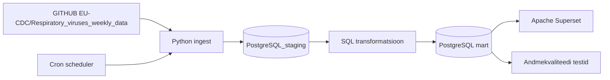

# MAMM — Euroopa hingamisteede viiruste hooajaline seire

> **Juhend:** Asenda kõik nurksulgudes vormid oma sisuga enne esitamist. Kustuta see juhendrida.

## Äriküsimus


Jälgime kolme hingamisteede haiguse (Influenza, RSV, SARS-CoV-2) levikut Euroopa riikides, et aidata inimestel hinnata haigusaktiivsust ning teha teadlikumaid reisimisotsuseid.


**Mõõdikud:**

1. Positiivsete testide arv nädalate lõikes riigi ja haiguse kaupa
    * Arvutame iga nädala kohta positiivsete hingamisteede viiruse testide koguarvu Euroopa riikides.
2. Positiivsete testide määr riikide lõikes
    * Arvutame positiivsete testide osakaalu kõigist tehtud testidest iga riigi kohta nädalapõhiselt.
3. Positiivsete testide määr viirusetüüpide lõikes
    * Võrdleme Influenza, RSV ja SARS-CoV-2 positiivsete testide määra riikide ja nädalate lõikes.

## Arhitektuur



Täpsem kirjeldus: [`docs/arhitektuur.md`](docs/arhitektuur.md)

## Andmestik

| Allikas | Tüüp | Ajas muutuv? | Roll |
|---------|------|--------------|------|
| ECDC respiratory virus surveillance data | CSV | Jah, nädalapõhiselt, laupäeviti | Põhiandmevoog |
| [Hetkel meie lahenduse juures pole] | [seed / dim-tabel] | Ei, staatiline | Kõrvaltabel |

## Stack

| Komponent | Tööriist |
|-----------|---------|
| Sissevõtt | Python |
| Transformatsioon | SQL |
| Andmehoidla | PostgreSQL |
| Näidikulaud | Apache Superset |
| Orkestreerimine | cron |

## Käivitamine

## Käivitamine

```bash
# 1. Klooni repo ja liigu kausta
git clone https://github.com/MariliisR/ecdc-haigusseire.git
cd ecdc-haigusseire

# 2. Kopeeri keskkonnamuutujad
cp .env.example .env
# Muuda .env failis paroolid vastavalt vajadusele

# 3. Käivita teenused — andmed laaditakse automaatselt
docker compose up -d --build
```

Superset: http://localhost:8088 (kasutaja: admin / parool: vaata .env)

## Saladused ja konfiguratsioon

Kõik saladused (paroolid, API võtmed, andmebaasi URL-id) on `.env` failis. Repos on ainult `.env.example`, mis näitab vajalike muutujate struktuuri ilma tegelike väärtusteta. Päris `.env` faili ei tohi GitHubi panna - see on `.gitignore`-s.

Vajalikud muutujad:

| Muutuja | Tähendus | Näide |
|---------|----------|-------|
| `DB_PASSWORD` | PostgreSQL parool | (saladus) |
| `[teised]` | ... | ... |

## Andmevoog lühidalt

1. **Sissevõtt** — Pythoni ingest2-skript laeb ECDC seireandmed alla ning salvestab need Bronze kihti.
2. **Laadimine** — Toorandmed salvestatakse PostgreSQL Bronze skeemi
3. **Transformatsioon** — Silver kihis andmed puhastatakse ja normaliseeritakse.
                        — Gold kihis arvutatakse nädalapõhised agregeeritud mõõdikud.
4. **Testimine** — [Mitu] andmekvaliteedi testi kontrollivad korrektsust
5. **Näidikulaud** — Apache Superset visualiseerib haigusaktiivsuse trendid ja positiivsuse määrad.

## Andmekvaliteedi testid

Projekt kontrollib järgmist:

1. Bronze tabelis peab olema vähemalt üks rida.
2. yearweek väärtus ei tohi olla NULL.
3. countryname ei tohi olla NULL.
4. pathogen väärtus ei tohi olla NULL.
5. value väärtus ei tohi olla negatiivne.
6. indicator väärtus peab olema üks lubatud väärtustest: detections, tests või positivity.
7. Silver fact tabelis ei tohi olla duplikaate primaarvõtme väljade lõikes.
8. Silver kihis peavad olema ainult äriküsimuse jaoks vajalikud viirused: Influenza, RSV ja SARS-CoV-2.
9. Silver kihis peavad indicator väärtused olema ainult tests või detections.

Testide tulemused: Testide tulemused salvestatakse tabelisse quality.test_results. 
Tulemusi saab vaadata PostgreSQL päringuga:

SELECT *
FROM quality.test_results
ORDER BY layer, test_name;

## Projekti struktuur

```
.
├── README.md
├── compose.yml
├── .env.example
├── .gitignore
├── docs/
│   ├── arhitektuur.md      ← nädal 1 väljund
│   └── progress.md         ← nädal 2 väljund
└── ...                     ← ülejäänud projektifailid
```

## Kokkuvõte, puudused ja võimalikud edasiarendused

**Kokkuvõte:**
- Valmis on:
    * ingest pipeline
    * Bronze / Silver / Gold kihid
    * PostgreSQL andmeladu
    * [nädalapõhised mõõdikud]
    * [Superseti dashboardid]

**Puudused:**
- [Loetle ausalt, mis jäi tegemata - see ei mõjuta hinnet negatiivselt, vaid aitab hinnata]
- [automaatseid data quality alert’eid veel ei ole]
- [incremental processing puudub]
- [dashboard refresh toimub käsitsi]

**Mis edasi:**
- [Mida tahaksid edasi teha, kui aega oleks rohkem]

## Meeskond

| Nimi | Roll |
|------|------|
| Mariliis | andmeallika omanik |
| Madli | transformatsioonide omanik |
| Mirell | andmekvaliteedi omanik |
| Annika | näidikulaua omanik |
