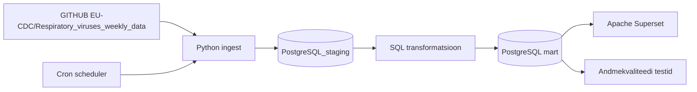
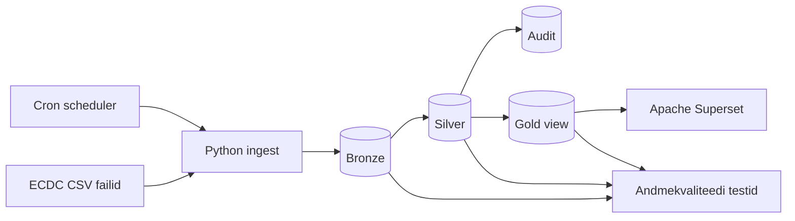

# Arhitektuur

## Äriküsimus

Jälgime kolme hingamisteede haiguse (Influenza, RSV, SARS-CoV-2) levikut Euroopa riikides, et aidata inimestel hinnata haigusaktiivsust ning teha teadlikumaid reisimisotsuseid.

## Mõõdikud

1. Esimene mõõdik — Positiivsete testide arv nädalate lõikes - arvutame iga nädala kohta positiivsete hingamisteede viiruse testide koguarvu Euroopa riikides 
2. Teine mõõdik - Positiivsete testide määr riikide lõikes - arvutame positiivsete testide osakaalu kõigist tehtud testidest iga riigi kohta nädalapõhiselt
3. Kolmas mõõdik — Positiivsete testide määr viirusetüüpide lõikes (Influenza, RSV, SARS-CoV-2) - arvutame positiivsete testide arvu viirusetüüpide lõikes igal nädalal igas riigis

## Andmeallikad

| Allikas | Tüüp | Ajas muutuv? | Roll |
|---------|------|--------------|------|
|GITHUB EU-CDC/Respiratory_viruses_weekly_data SARITestsDetectionsPositivity.csv | CSV | Jah, kord nädalas | Andmestikus on testid, mis on tehtud haiglates ja annab meile raskemate juhtumite info. | 
|GITHUB EU-CDC/Respiratory_viruses_weekly_data sentinelTestsDetectionsPositivity.csv | CSV | Jah, kord nädalas | Andmestikus on testid, mis on tehtud mujal, nt. perearsti juures, siit saame keskmise ja kergema taseme põdemised. |

## Andmevoog

/*

*/

## Andmebaasi kihid

/*
| Kiht | Roll |
|------|------|
| `PostgreSQL_staging` | Hoiab allika andmeid töötlemata kujul. |
| `PostgreSQL mart` | Hoiab transformeeritud ja äriloogikat sisaldavaid tabeleid. |
*/

| Kiht     | Roll                                                                                       |
| -------- | ------------------------------------------------------------------------------------------ |
| `Bronze` | Hoiab ECDC allikast laaditud toorandmeid muutmata kujul.                                   |
| `Silver` | Sisaldab puhastatud, filtreeritud ja normaliseeritud andmeid, mida kasutatakse analüüsiks. |
| `Gold`   | Sisaldab äriküsimuste jaoks vajalikke mõõdikuid ja agregeeritud tulemusi.                  |
| `Audit`  | Säilitab Silver kihist eemaldatud kirjed koos kustutamise aja ja põhjusega.                |

## Auditimine

Projekt kasutab audit-skeemi andmete jälgitavuse tagamiseks.

Incremental laadimise käigus võrreldakse Silver kihis olevaid andmeid allikafailidega.

Kui allikast on kirje eemaldatud:

1. Kirje kopeeritakse audit-tabelisse `audit.deleted_fact_respiratory_surveillance`
2. Salvestatakse kustutamise aeg (`deleted_at`)
3. Salvestatakse kustutamise põhjus (`delete_reason`)
4. Kirje eemaldatakse Silver kihist

See võimaldab:
- säilitada ajaloolist infot,
- analüüsida allika muudatusi,
- taastada ekslikult eemaldatud kirjeid,
- auditeerida ETL protsessi tööd.

## Tööjaotus

| Roll | Vastutus | Täitja |
|------|----------|--------|
| Andmeallika omanik | Kirjutab sissevõtu loogika ja haldab andmeallika laadimist | Mariliis Randmer |
| Transformatsioonide omanik | Kirjutab mart kihi mudelid ja mõõdikute arvutuse | Madli Potti |
| Kvaliteedi omanik | Kirjutab testid ja vaatab läbi ebaõnnestunud kontrollid | Mirell Mägi |
| Näidikulaua omanik | Ehitab näidikulaua ja seob selle äriküsimusega | Annika Kask |

## Riskid

| Risk                          | Mõju                                           | Maandus                                                                                                                                                  |
| ----------------------------- | ---------------------------------------------- | -------------------------------------------------------------------------------------------------------------------------------------------------------- |
| Andmed muutuvad tagantjärele. | Välja kuvatavad andmed ei vasta tegelikkusele. | Incremental laadimine võrdleb uusi ja olemasolevaid kirjeid. Muutunud kirjed uuendatakse ning eemaldatud kirjed logitakse audit-skeemi enne kustutamist. |
| Andmeallikaid ei uuendata regulaarselt. | Uue nädala tulemus jääb sisse laadimata ja sisu aegub ning näidikulaud jääb tühjaks. | Ehitame protsessi selliselt, et kui andmeid peale ei tule, siis protsess jätkab andmete järele pärimist mõistliku regulaarsusega. Võimalusel kuvab seni hoiatavat silti näidikulaual. |
| Mõne riigi nädalased andmed võivad jääda puudulikuks, kui andmeid ei esitata | Võrdlused riikide vahel võivad olla ebatäpsed ning analüüs võib põhineda mittetäielikel andmetel. | Rakendame quality checkid puuduvate väärtuste tuvastamiseks ja märgime puuduvad andmed näidikulaual.
| Mõnes riigis on detections_total suurem kui tests_total. | Positiivsuse määr võib ületada 100%, mis on andmeanalüüsis eksitav. | Tegemist on teadaoleva ECDC andmekvaliteedi probleemiga — põhjuseks võib olla aruandlusperioodide erinevus, dubleerimine või tagantjärele korrigeerimine. Andmeid ei filtreerita välja, kuid olukord on dokumenteeritud. Tulevikus lisatakse logimisfunktsioon, mis tuvastab sellised read automaatselt. |

## Privaatsus ja turve

Andmestik sisaldab agregeeritud seireandmeid riigi, nädala, viiruse ja mõõdiku tasemel. Isikuandmeid ega tundlikke terviseandmeid ei töödelda.
Andmebaasi paroolid tulevad .env failist.
