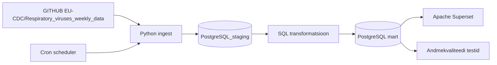

# Arhitektuur

## Äriküsimus

Jälgime kolme hingamisteede haiguse (Influenza, RSV, SARS-CoV-2) levikut Euroopa riikides, et aidata inimesel otsustada, kuhu on turvalisem reisida.

## Mõõdikud

1. Esimene mõõdik — Positiivsete hingamisteede viiruste testide arv Euroopa riikide lõikes 
2. Teine mõõdik - Positiivsete testide arv nädalate lõikes - arvutame iga nädala kohta 
3. Kolmas mõõdik — positiivsete testide arv viirusetüüpide lõikes (Influenza, RSV, SARS-CoV-2)

## Andmeallikad

| Allikas | Tüüp | Ajas muutuv? | Roll |
|---------|------|--------------|------|
| Respiratory viruses weekly data GitHub repository | CSV | Jah, kord nädalas | [Milleks kasutatakse?] |

## Andmevoog

> Täpsusta diagrammi vastavalt oma projektile — lisa rohkem andmeallikaid, mudeleid või teenuseid.

## Andmebaasi kihid

| Kiht | Roll |
|------|------|
| `staging` | Hoiab allika andmeid töötlemata kujul. |
| `mart` | Hoiab transformeeritud ja ärilogikat sisaldavaid tabeleid. |

## Tööjaotus

| Roll | Vastutus | Täitja |
|------|----------|--------|
| Andmeallika omanik | Kirjutab sissevõtu loogika, hoiab API-t töös | [Nimi] |
| Transformatsioonide omanik | Kirjutab mart kihi mudelid ja mõõdikute arvutuse | [Nimi] |
| Kvaliteedi omanik | Kirjutab testid ja vaatab läbi ebaõnnestunud kontrollid | [Nimi] |
| Näidikulaua omanik | Ehitab näidikulaua ja seob selle äriküsimusega | [Nimi] |

## Riskid

| Risk | Mõju | Maandus |
|------|------|---------|
| [Risk 1 — näiteks: API ei vasta] | [Mis juhtub?] | [Kuidas maandad?] |
| [Risk 2] | [Mis juhtub?] | [Kuidas maandad?] |
| [Risk 3] | [Mis juhtub?] | [Kuidas maandad?] |

## Privaatsus ja turve

[Kirjelda, millised isiku- või tundlikud andmed teie projektis esinevad (kui üldse) ja kuidas neid kaitsete. Isikuandmed peavad olema anonümiseeritud. Andmebaasi paroolid peavad tulema `.env` failist.]
