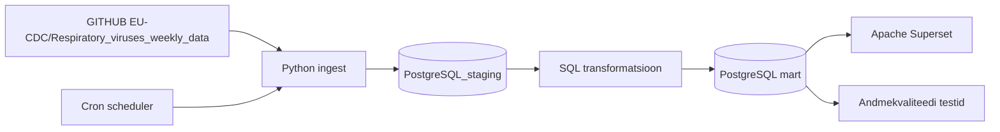

# Arhitektuur

## Äriküsimus

Jälgime kolme hingamisteede haiguse (Influenza, RSV, SARS-CoV-2) levikut Euroopa riikides, et aidata inimestel hinnata haigusaktiivsust ning teha teadlikumaid reisimisotsuseid.

## Mõõdikud

1. Esimene mõõdik — Positiivsete testide arv nädalate lõikes - arvutame iga nädala kohta positiivsete hingamisteede viiruse testide koguarvu Euroopa riikides 
2. Teine mõõdik - Positiivsete testide määr riikide lõikes - arvutame positiivsete testide osakaalu kõigist tehtud testidest iga riigi kohta nädalapõhiselt
3. Kolmas mõõdik — Positiivsete testide määr viirusetüüpide lõikes (Influenza, RSV, SARS-CoV-2) - arvutame positiivsete testide arvu viirusetüüpide lõikes igal nädalal igas riigis

## Andmeallikad

| Allikas | Tüüp | Ajas muutuv? | Roll |
|---------|------|--------------|------|
|GITHUB EU-CDC/Respiratory_viruses_weekly_data SARITestsDetectionsPositivity.csv | CSV | Jah, kord nädalas | Andmestikus on testid, mis on tehtud haiglates ja annab meile raskemate juhtumite info. | 
|GITHUB EU-CDC/Respiratory_viruses_weekly_data sentinelTestsDetectionsPositivity.csv | CSV | Jah, kord nädalas | Andmestikus on testid, mis on tehtud mujal, nt. perearsti juures, siit saame keskmise ja kergema taseme põdemised. |

## Andmevoog

## Andmebaasi kihid

| Kiht | Roll |
|------|------|
| `PostgreSQL_staging` | Hoiab allika andmeid töötlemata kujul. |
| `PostgreSQL mart` | Hoiab transformeeritud ja äriloogikat sisaldavaid tabeleid. |

## Tööjaotus

| Roll | Vastutus | Täitja |
|------|----------|--------|
| Andmeallika omanik | Kirjutab sissevõtu loogika, hoiab API-t töös | Mariliis Randmer |
| Transformatsioonide omanik | Kirjutab mart kihi mudelid ja mõõdikute arvutuse | Madli Potti |
| Kvaliteedi omanik | Kirjutab testid ja vaatab läbi ebaõnnestunud kontrollid | Mirell Mägi |
| Näidikulaua omanik | Ehitab näidikulaua ja seob selle äriküsimusega | Annika Kask |

## Riskid

| Risk | Mõju | Maandus |
|------|------|---------|
| Andmeallikaid ei uuendata regulaarselt. | Uue nädala tulemus jääb sisse laadimata ja sisu aegub ning näidikulaud jääb tühjaks. | Ehitame protsessi selliselt, et kui andmeid peale ei tule, siis protsess jätkab andmete järele pärimist mõistliku regulaarsusega. Võimalusel kuvab seni hoiatavat silti näidikulaual. |
| Andmed muutuvad tagantjärele. | Välja kuvatavad andmed ei vasta tegelikkusele. | Valime sobiva ajaakna, mille raames andmete sisse laadimise protsess võrdleb vanu tulemusi baasis olevaga ja kui väärtus erineb, kirjutab vana üle, kui ei, siis jätab samaks. |
| Mõne riigi nädalased andmed võivad jääda puudulikuks, kui andmeid ei esitata | Võrdlused riikide vahel võivad olla ebatäpsed ning analüüs võib põhineda mittetäielikel andmetel. | Rakendame quality checkid puuduvate väärtuste tuvastamiseks ja märgime puuduvad andmed näidikulaual.
| Mõnes riigis on detections_total suurem kui tests_total. | Positiivsuse määr võib ületada 100%, mis on andmeanalüüsis eksitav. | Tegemist on teadaoleva ECDC andmekvaliteedi probleemiga — põhjuseks võib olla aruandlusperioodide erinevus, dubleerimine või tagantjärele korrigeerimine. Andmeid ei filtreerita välja, kuid olukord on dokumenteeritud. Tulevikus lisatakse logimisfunktsioon, mis tuvastab sellised read automaatselt. |

## Privaatsus ja turve

Isiku- ega tundlikke andmeid antud projektis ei kasutata. Meditsiinilised andmed kuuluksid tundlike andmete hulka, kuid kuna tegemist on anonüümsete andmestikega, kus teame ainult testi tegemise nädalat, riiki ja testitulemuse saanud isiku vanust (millest viimast analüüsi ei kaasa), ei ole selle põhjal võimalik isikuid ka kaudselt tuvastada.
Andmebaasi paroolid tulevad .env failist.
